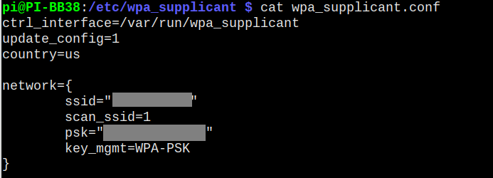
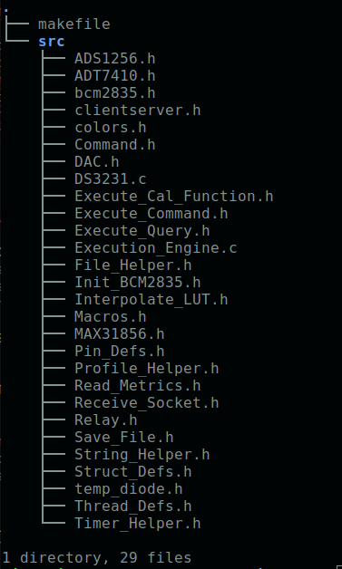
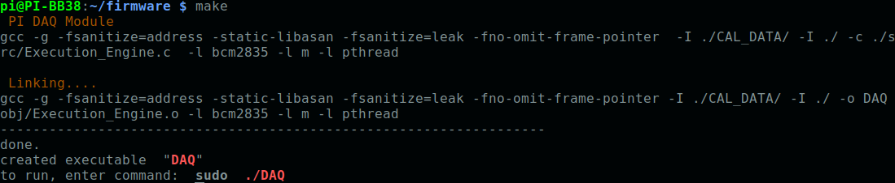
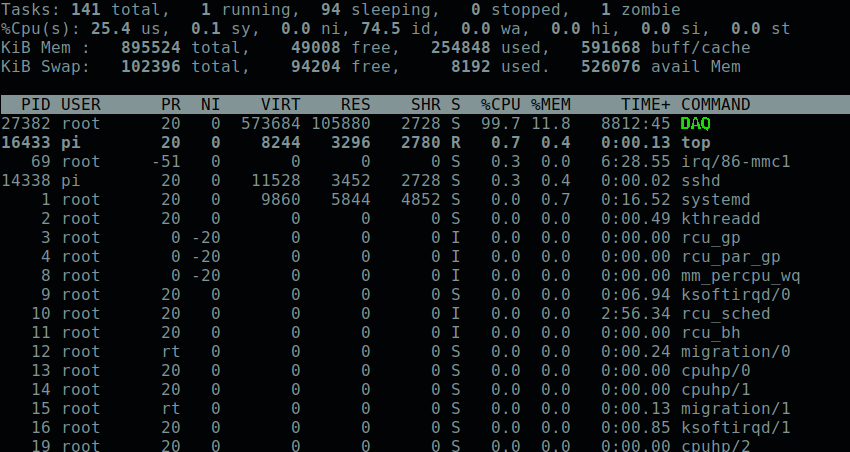
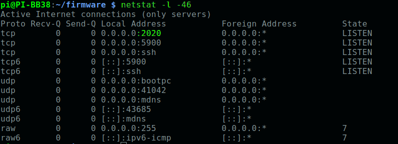
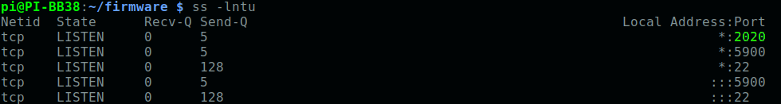

# Raspberry Pi Based Data Acquistion System

# Directories in Repository    
## Docs    
Contains various documentation info  created while building the software. Specification of commands to the client interface. Information on the ADC Loop, which is continuosly read out by the Raspberry Pi. Some notes on initial configuration of a Pi DAQ. Some how to files that may be useful while administrating the Pi DAQ.

## PCB    
PI DAQ PCB Files    
Contains the files needed to FAB the Pi DAQ. All Gerber board files are present. The native Kicad project files are present as well, for maintenance and modification. There is rework required for the version of gerbers used here. I'll try to include the rework file, as well as a "fixed/corrected" version of the Kicad project files. 

Cal Station Board Files
The PCB files for the Cal Station board are present as well, however I would not reccomend ordering this baord. It was done extremely quickly and many mistakes were made. There was MUCH rework required to make the PCB functional. Almost all of the relay footprints are off. The relay part fits, but some of the pins are swapped. It was unpleasant to re-route all the signals with hookup wire, you would save yourself much time by starting over.    

All BOMS should be present as well.    


## Pi Firmware
This folder contains the release versions of firmware that runs on the Pi DAQ. The different versions are kept for documentation and bug fixes. Also, the Configuration folder contains useful code to configure a Pi for the first time. It performs functions like:
  - Configuring hostname on the Pi
  - Configure user accounts
  - Getting / Setting Environment variables
  - Setting up alias commands for the pi user
  - setting default IP address and network configuration
  - Enabling SPI & I2C on the pi
  - Enabling SSH
  - Enable AutoLogin at boot for user pi
  - Getting the micro SD card usage stats

# Code Installation and Usage
## Source Code Download 
To download the code to the Pi, make sure you have an active internet connection on the Pi. This may involve editing the /etc/wpa_supplicant/wpa_supplicant.conf file on the Pi to add the credentials for the wifi network you want to connect to. The file will look like this:    
   
modify it by filling in the ssid of the network and the pre shared key (password) of the network.   

After conneting to Wifi/Internet, make a directory for the firmware:   
```mkdir /home/pi/firmware```   
```cd /home/pi/firmware```    
    
now clone the github repo:   
```git clone https://github.com/johnpolakow/PI_Blackbox.git```       

move everything to parent folder:         
```cd PI_Blackbox/```      
```mv -f ./* ../```     
```cd ..```
```rm -rf PI_Blackbox/```    

The PCB directory is not needed on the Pi:     
```rm -rf PCB/```     

move Docs folder to parent dir:    
```mv -f Docs/ ../```   

Change to Pi_Firmware directory and remove unnecesary releases, and move Configuration directory:      
```cd PI_Firmware/```     

Only the latest version is needed. You can remove the directories for older versions. For instance if you want to remove *Release0/* directory:    
```rm -rf Release0/```    

Move **Configuration/** directory to another location:    
```mv Configuration/ ../../```      

Last, the contents of the latest release may be moved to the firmware folder:    
```cd Release1```       
```mv -f ./* ../../```    
```cd ..```    
```rm -r Release1```    
```rm -r PI_Firmware/```     

You should now have two items in the **/home/pi/firmware/** folder:     
  - src/ folder, containing source code for compiling the DAQ executable    
  - makefile, to compile the source code    
    

## Compilation    
Compile the source code with the **make** command:    
   

the **DAQ** binary will be created. It can be executed directly with the command:     
```sudo ./DAQ```     

or, alternatively, the server process can be started with:     
```sudo systemctl restart Blackberry.service```    

check to see the process is running with the **top** command:   
```top```     
after executing the command a process display will popup. **DAQ** should be at the top:    
   
to exit out of the process display screen, hit the **q** button 

If DAQ process is not shown, then you need to either execute the DAQ process directly or start the Blackberry systemd service with:   
```sudo systemctl start Blackberry.service```


## SystemD Maintenance and Server Process Start     
 Some commands to administrate the Blackberry server process.
 see process status:        
```sudo systemctl status Blackberry.service```     

start the process:   
```sudo systemctl start Blackberry.service```    

stop the process:   
```sudo systemctl stop Blackberry.service```    

to start service at boot:    
```sudo systemctl enable [Blackberry.service]```    

view the server process file:   
```sudo systemctl cat Blackberry.service```

edit the service file:    
```sudo systemctl edit --full Blackberry.service```   

find out if the service is enabled:   
```sudo systemctl is-enabled Blackberry.service```

see log entries related only the the PI DAQ server process:   
```sudo journalctl UNIT=Blackberry.service```

```daemon-reload```

## Socket Connections    
The DAQ process opens tcp port 2020 and waits for a client to connect. To verify the port is open and listening, try these commands:    
```sudo ss -l -p | grep -vE '^(u_|nl )'```   
```sudo ss -lntu```    
```netstat -l -46```    
   
   

## Querying the Server from a Client Machine
see client code repository. Also see 'Pi_Blackbox_Software_Behavioral_Specification' in the Docs/ directory:   
https://github.com/johnpolakow/PI_Blackbox/tree/master/Docs        
https://github.com/johnpolakow/PI_Blackbox/blob/master/Docs/Pi%20Blackbox%20Software%20Behavioral%20Specification_v2.pdf     
https://github.com/johnpolakow/Blackbox_Client    

## Lessons Learned
Things I would do differently if I was to do another version of this board:     
  - Do the layout in Cadence
  - Use switching regulator to drop input of +18-24V down to +13-14V. Eliminating the need for fan and heat sink
  - Low noise *switching* regulator for Pi voltage supply. The present switching converter IC required softening of the switching waveform to get the noise down.
  - Change 2N3055 BJT based programmable current source to FET based. 
  - smaller SMD crystals
  - Use SOM instead of full Pi Board
  - High speed ADCs for Voltage and Current measurement. More accurate power metric + phase information
  - More compact electrolytic caps
  - Only use ceramic caps near LT1054 voltage inverter. Tantalum cap ended up failing due to high ESR and switching current
  - smaller input capacitance, to lower the inrush current